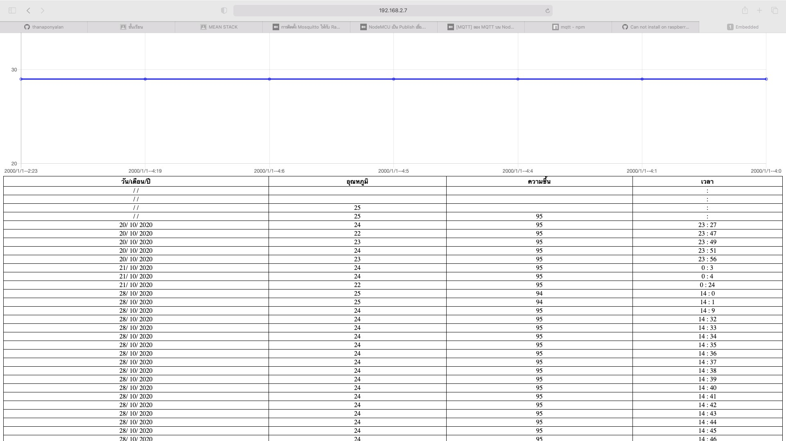
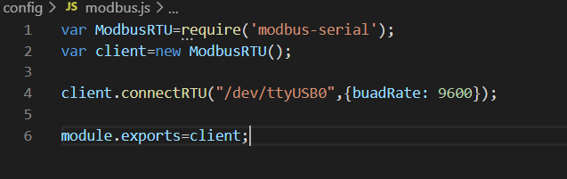
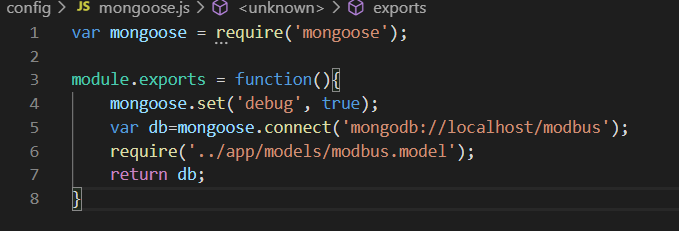
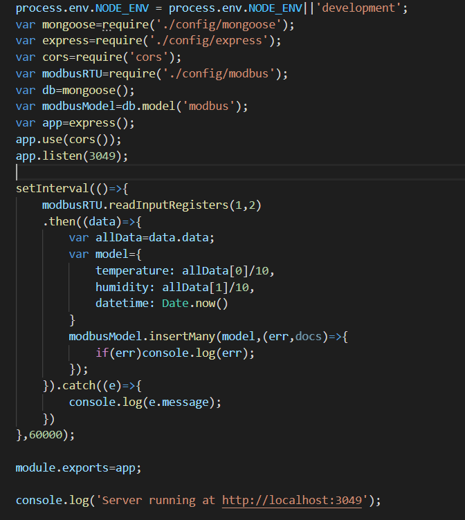

# s60030049

ใช้โค้ดจากงาน RTC https://github.com/GT013/s60030049.git

1.config->modbus.js เชื่อมต่อพอร์ท modbus ttyUSB0 และใช้ buadRate: 9600

2. แก้ไขไฟล์ config->mongoose.js ดังรูป

3. ไฟล์ index.js setInterval ดังรูป

เรียกใช้งานคำสั่ง node index.js
